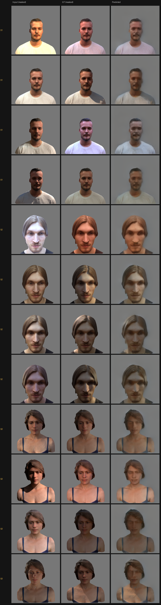
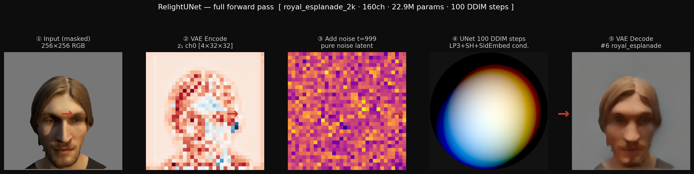
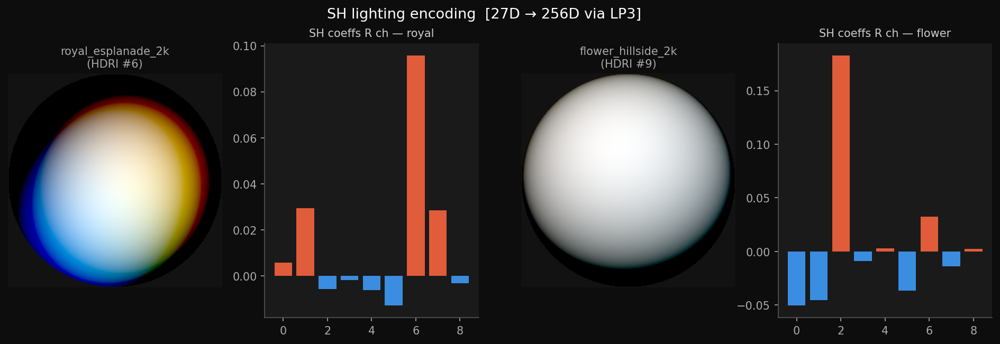
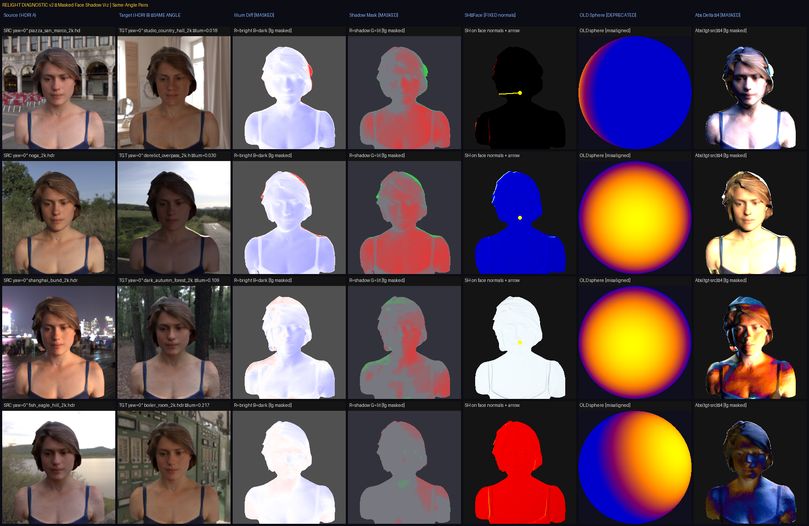
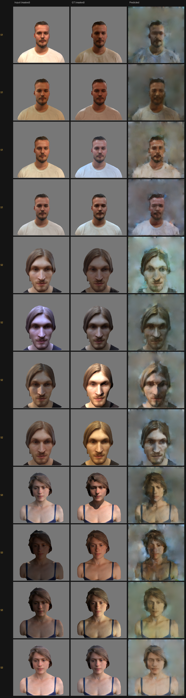
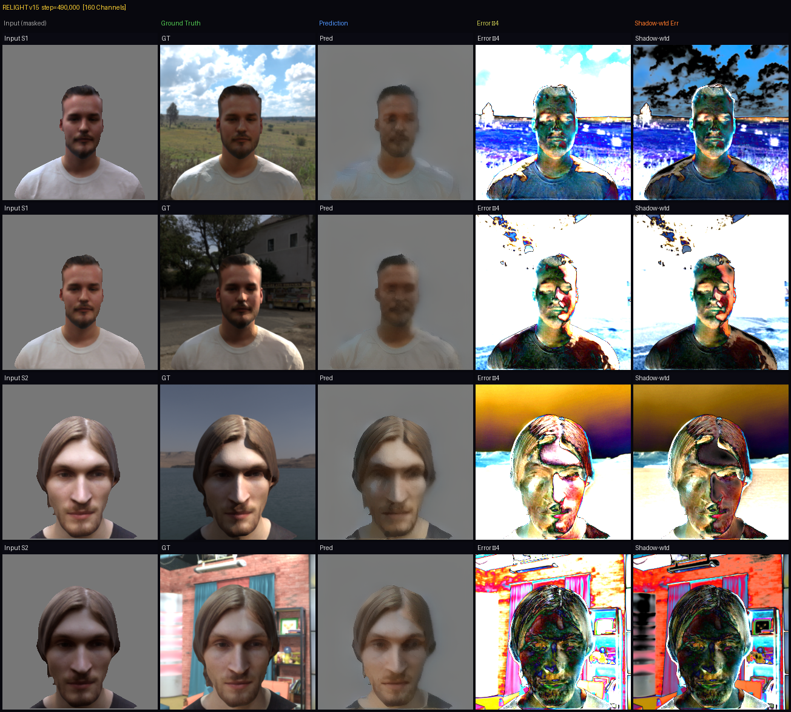
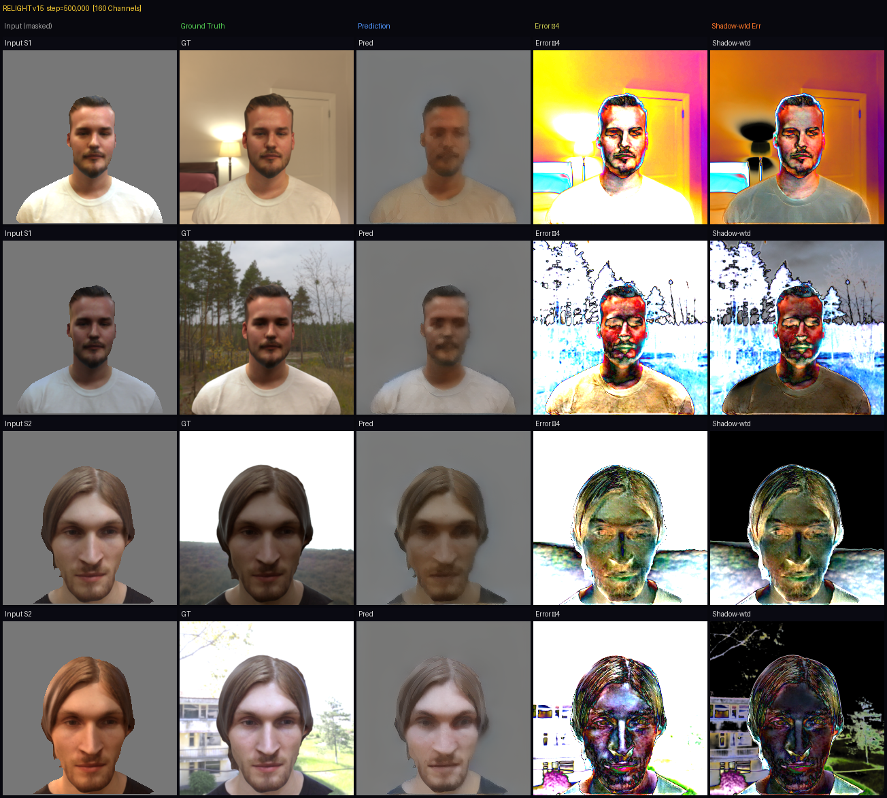

<div align="center">

# 🔆 Face Relighting

### Diffusion-based Photorealistic Face Relighting from Synthetic Data + HDRIs

**UGP-2 · Prof. Tushar Sandhan · IIT Kanpur · April 2026**

*Dev Sachan · 230353*

[](https://python.org)
[](https://pytorch.org)
[](https://blender.org)
[](https://kaggle.com)
[](LICENSE)

**Every HDRI change in Blender = hours of re-rendering. This does it in 60ms.**

| 62,775 Renders | 465 HDRIs | ~15M Params | 60ms Inference |
|:-:|:-:|:-:|:-:|

</div>

---

## 🎬 Demo — 45 Lighting Angles, One Face

<div align="center">
  
  <br>
  <em>One face × one HDRI × 45 rotation angles (8° steps) — all auto-exposed</em>
</div>

---

## 📸 Results

<div align="center">
  
  <br><br>
  
  <br><br>
  
  <br>
  <em>Same face — completely different HDRI environments · Training sample grid step 500k · All 3 subjects</em>
</div>

---

## 🎯 The Problem We Solved

```
Every HDRI change in Blender  →  hours of GPU re-rendering
Manual lighting for VFX       →  days of iteration
Photo editors                 →  fake, unnatural shadows
ML datasets                   →  need thousands of lighting conditions
```

**Our answer:** One forward pass through a diffusion model — photorealistic relighting, identity preserved, in **60ms**.

---

## 🧠 Architecture

<div align="center">
  
  <br>
  <em>Full forward pass: Input → VAE Encode → Add Noise → UNet (HDRI conditioned via LP3+SH) → VAE Decode → Output</em>
</div>

```
Input face (256×256 RGB)
        │
        ▼
  VAE Encode → z₁ [4×32×32]        HDRI file (.hdr)
  frozen SD-VAE · 8× compression          │
        │                          SH Coefficients [27D]
        ▼                                 │
  Add DDPM noise                    LP3 Encoder MLP
  cosine schedule                   27D → 512 → 256
  t = 0 → 999                       ze_hdri [256D]
        │                                 │
        └──────────────┬──────────────────┘
                       │ + SidEmbed (subject identity)
                       ▼
              UNet Denoise
              160 base channels · 4 res levels
              AdaGroupNorm conditioning
              SelfAttention mid-block
                       │
                       ▼
             VAE Decode → Output (256×256 RGB)
```

### Key Components

| Component | Detail |
|---|---|
| **UNet** | 160 base channels · 4 resolution levels · AdaGN conditioning |
| **LP3 Encoder** | 3-layer MLP · lifts 27D SH coefficients → 256D ze |
| **SidEmbed** | Learned subject identity token · prevents identity drift |
| **VAE** | Frozen `stabilityai/sd-vae-ft-mse` · 8× spatial compression |
| **Diffusion** | DDPM cosine schedule · 30 DDIM steps at inference |
| **Parameters** | ~15M trainable |
| **Inference** | 60ms on T4 GPU |

---

## 📦 Dataset Generation

62,775 training images — built entirely from scratch using a custom Blender pipeline.

<div align="center">
  
  <br>
  <em>SH lighting encoding — 27D spherical harmonic coefficients → 256D conditioning vector via LP3</em>
</div>

### Pipeline (`dataset_creation.py`)

```
3D Face Scans (OBJ)              465 real HDRIs
        │                               │
        ▼                               ▼
  Blender Cycles GPU           scan_and_rank_hdris()
  normalize_and_center()       Score = peak_lum × 0.65
  setup_materials()                   + dyn_range × 0.35
  skin SSS · hair aniso        4 tiers: SUNNY → FLAT
  eye roughness 0.05                  │
        │                             │
        └──────────────┬──────────────┘
                       ▼
              45 HDRI rotations × 8°
              rotate_hdri() each step
              adjust_exposure() → face lum target 0.5–0.7
                       │
                       ▼
              bpy.ops.render.render()
              512×512 PNG + metadata.json
```

| Stat | Value |
|---|---|
| Total renders | **62,775** |
| HDRI environments | **465** |
| Rotations per HDRI | **45 × 8°** |
| HDRI tiers | **4** (SUNNY / DECENT / SOFT / FLAT) |
| Output resolution | **512×512 → 256×256** |
| Dataset size | **~5 GB** |
| Subjects | **3** (photogrammetry scans) |

---

## 🏋️ Training

### 7 Losses — Each Fixes Something Specific

| Loss | Weight | Purpose |
|---|---|---|
| MSE | 1.0 | Pixel anchor · face 5×, bg 0.15× |
| LPIPS | 4.0 | Perceptual sharpness via VGG |
| **Shadow** | **12.0** | Directional shadow must match HDRI |
| Color Histogram | 1.5 | No desaturation |
| Frequency | 3.0 | Sharp edges via Sobel |
| Saturation | 3.5 | No washed-out skin |
| Color MV | 3.5 | Mean + variance of latent channels |

> **Shadow loss at 12.0** is the most critical — 3× heavier than LPIPS, 12× heavier than MSE.
> Uses quadratic penalty: `loss = (diff + 1.5 · diff²).mean()`
> This exponentially punishes large shadow errors while staying stable on fine lines.

<div align="center">
  
  <br>
  <em>Shadow diagnostic: Source HDRI · Target · Illumination Diff · Shadow Mask (R=shadow G=lit) · SH face normals + light direction arrow</em>
</div>

### Hyperparameter Tuning

| Change | From → To | Reason |
|---|---|---|
| Shadow weight | 4.0 → **12.0** | Grey smudges — tripled + added quadratic penalty |
| LPIPS weight | 2.0 → **4.0** | Predictions too blurry |
| Saturation weight | 5.0 → **3.5** | Skin turning grey — relaxed to allow vibrant tones |

### Training Progression

<div align="center">
  
  <br>
  <em>Step 10k — blurry ghost prediction, catastrophic error everywhere</em>
  <br><br>
  
  <br>
  <em>Step 490k — sharp face, correct directional light, error only on edges</em>
  <br><br>
  
  <br>
  <em>Step 500k — final quality · Input · GT · Prediction · Error ×4 · Shadow-wtd Error</em>
</div>

### Final Metrics

| Metric | Value |
|---|---|
| Training steps | 500,000 |
| GPU time | ~5 hrs on T4 |
| val MSE | 0.0196 |
| val LPIPS | 0.1218 |
| Best combined loss | 0.0498 |

---

## 🗂️ Repository Structure

```
relighting/
│
├── dataset_creation.py        # Blender pipeline — generates 62,775 training images
├── training_inference.ipynb   # Full training loop + DDIM inference (Kaggle)
├── Face_Relighting.pptx       # Project presentation
│
├── assets/                    # Visualizations
│   ├── pipeline.png           # Full forward pass strip
│   ├── sh_conditioning.png    # SH lighting encoding viz
│   ├── shadow_viz.png         # Shadow loss diagnostic
│   ├── sample_final.png       # Final training sample grid
│   ├── diag_step0500000.png   # Final diagnostic (step 500k)
│   ├── diag_step0490000.png   # Mid diagnostic (step 490k)
│   ├── diagnostic_early.png   # Early diagnostic (step 10k)
│   └── ezgif.com-animated-gif-maker.gif  # 45-angle rotation demo
│
└── results/                   # Output samples
    ├── results1.png
    └── result2.png
```

---

## 🚀 Running the Code

### 1. Dataset Generation

Requirements: Blender 3.6+, OBJ face models, 465 HDRIs

```python
# Edit these paths at the top of dataset_creation.py
FACE_ROOT_INPUT = "path/to/obj/models"
HDRI_FOLDER     = "path/to/hdri/files"
OUTPUT_ROOT     = "path/to/save/renders"

# Then run inside Blender:
blender --background --python dataset_creation.py
```

### 2. Training

Open `training_inference.ipynb` on Kaggle with T4 GPU.

```python
# Key config inside notebook
CFG = {
    "image_size"    : 256,
    "total_steps"   : 500_000,
    "base_ch"       : 160,      # UNet base channels
    "batch_size"    : 4,        # T4 optimized
    "ddim_steps"    : 30,       # inference steps
    "shadow_weight" : 12.0,     # most important loss weight
    "lpips_weight"  : 4.0,
    "lr"            : 3e-5,
}
```

### 3. Inference

```python
# Run inside notebook after loading checkpoint
pred_latent = run_ddim(
    unet, lp3, sid_embed, ddpm,
    z1       = vae_encode(input_face),   # [1, 4, 32, 32]
    ze_input = sh_coeffs_from_target_hdri,  # [1, 36]
    n_steps  = 30,
    device   = "cuda"
)
output_image = vae_decode(pred_latent)  # [1, 3, 256, 256]
```

---

## 📊 Presentation

Full project slides with architecture diagrams, training analysis, and results:

📥 **[Download Face_Relighting.pptx](Face_Relighting.pptx)**

---

## 📋 Requirements

```
torch>=2.0
torchvision
diffusers        # SD-VAE
lpips            # perceptual loss
numpy
pandas
Pillow
tqdm
wandb            # optional — training monitoring
```

For dataset generation, run inside Blender's Python environment (`bpy` is built-in).

---

## 💡 Key Design Decisions

**Why synthetic data?**
Real paired relighting data (same face, different lighting) is nearly impossible to collect at scale. Blender Cycles with photogrammetry scans gives photorealistic renders with perfect ground truth pairs — zero manual annotation.

**Why diffusion over direct regression?**
Direct regression averages over lighting uncertainty → blurry outputs. Diffusion models learn the full conditional distribution → sharp, coherent lighting transfer.

**Why shadow weight = 12?**
Shadow direction is the hardest signal to transfer. Without heavy weighting the model produces flat grey faces. The quadratic term `diff + 1.5·diff²` punishes large shadow errors exponentially harder while keeping fine shadow lines stable.

**Why LP3 + SidEmbed?**
SH coefficients alone don't capture subject-specific reflectance. The subject embedding prevents the model from ignoring identity when strong lighting changes are applied.

---

## 👤 Author

**Dev Sachan** · Roll No. 230353
BS Economics · IIT Kanpur
UGP-2 under Prof. Tushar Sandhan

---

## 📄 License

MIT License — see [LICENSE](LICENSE) for details.

---

<div align="center">
  <em>62,775 synthetic renders · 465 HDRIs · 500k training steps · IIT Kanpur 2026</em>
</div>
